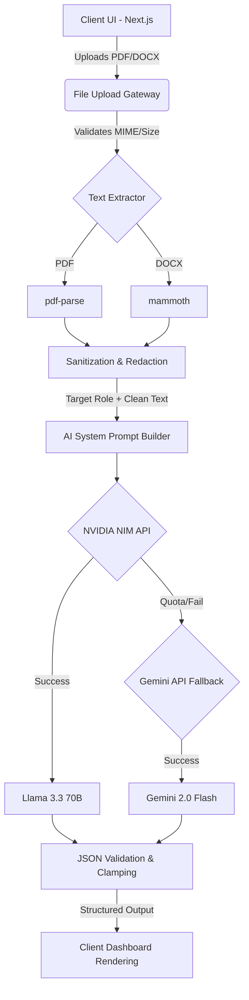

<div align="center">
  
# 🚀 ResumeIQ
**The Ultimate AI-Powered Resume Clearance Assistant**

[](https://nextjs.org/)
[](https://react.dev/)
[](https://www.typescriptlang.org/)
[](https://tailwindcss.com/)
[](https://build.nvidia.com/)
[](https://ai.google.dev/)

*Stop guessing what recruiters want. Start engineering your shortlisting probability.*

---
</div>

## 🧠 The Philosophy: From Analyzer to Assistant

Most resume analyzers are passive: they give you a generic score and say "Add more metrics." **ResumeIQ is different.** Recruiters do not hire generic "good resumes"—they hire for specific, targeted roles.

ResumeIQ acts as your **Resume Round Clearance Assistant**. 
1. **Upload your resume.**
2. **Select your target role** (e.g., Frontend Developer, Data Scientist, Product Manager).
3. **Get an actionable gap-analysis** benchmarking exactly what signals are missing for *that specific role*, and exactly what to add to secure an interview.

## ✨ Core Capabilities

- 🎯 **Role-Based Benchmarking**: Dynamic AI evaluation anchored against industry expectations for your specified target role.
- 💡 **Evidence-Based Coaching**: Replaces arbitrary scores with actionable, structured fixes mapped directly to your existing claims.
- ⏱️ **The 30-Minute Rule**: The AI is strictly constrained to only suggest framing/content improvements you can execute immediately, rather than suggesting you acquire new life experiences.
- 📉 **Gap Analysis**: Compares the expected structural sections for your target role against what was actually found.
- ⚡ **Multi-Model Inference Fallback**: Primary inference runs on **NVIDIA NIM (Llama 3.3 70B)** with zero-latency fallback to **Google Gemini 2.0 Flash**, ensuring 100% uptime.

## 📐 System Architecture

ResumeIQ is built on a highly resilient, modern full-stack Next.js pipeline:



## 📂 Project Structure

```bash
ResumeIQ/
├── app/
│   ├── src/
│   │   ├── app/                 # Next.js App Router Pages
│   │   │   ├── api/analyze/     # Secure serverless AI route
│   │   │   ├── page.tsx         # Main entry controller
│   │   │   └── globals.css      # Core Design System tokens
│   │   ├── components/          # React UI Components
│   │   │   ├── LandingScreen.tsx
│   │   │   ├── RoleSelectionScreen.tsx
│   │   │   ├── AnalyzingScreen.tsx
│   │   │   └── ResultsScreen.tsx
│   │   └── types/               # TypeScript Contracts
│   │       └── analysis.ts      # Strict JSON interface for AI
│   └── tests/                   # Automated validation suites
└── .env.local                   # Secret API keys (ignored)
```

## 🛠️ Quick Start

### Prerequisites
- Node.js 18+
- NVIDIA NIM API Key (for Llama 3.3 70B)
- Google Gemini API Key (for fallback engine)

### Setup

1. **Clone the repository:**
   ```bash
   git clone https://github.com/your-username/ResumeIQ.git
   cd ResumeIQ/app
   ```

2. **Install dependencies:**
   ```bash
   npm install
   ```

3. **Configure Environment Variables:**
   Create an `app/.env.local` file and add your keys:
   ```env
   NVIDIA_API_KEY=nvapi-your_nvidia_key
   GEMINI_API_KEY=your_gemini_key
   ```

4. **Launch the Development Server:**
   ```bash
   npm run dev
   ```
   Open [http://localhost:3000](http://localhost:3000) in your browser.

## 🧪 Testing

We employ a custom Node.js test runner to strictly validate edge-cases, malicious files, prompt injection attacks, and AI schema compliance.

To run the suite:
```bash
cd app
npm run test
```

## 🛡️ Security & Privacy

ResumeIQ takes document privacy seriously. 
- Processing happens entirely within ephemeral API functions.
- Files are parsed directly into memory via `Buffer` and are **never saved to disk**.
- Pre-processing aggressively redacts potential prompt-injection strings before data ever reaches the LLM.

---
<div align="center">
  <i>Built with precision for engineers, by engineers.</i>
</div>
